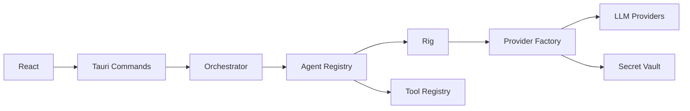

# LearnKit — Multi-Agent Desktop Boilerplate

Functional boilerplate for a **multi-agent desktop application** built with
**Tauri 2 + Rust + Rig (`rig-core` + `rig-agent`) + React + TypeScript + Vite + Bun**,
with **BYOK** (Bring Your Own Key) and Tokio as the async runtime.

This is not a finished product: it is a clean, extensible architecture for later
adding agents, tools, workflows and multi-agent systems.



## Architecture

```text
React UI
   │  Tauri commands / events
   ▼
Application Layer (application/)
   ├── AgentService · ProviderService · WorkflowService
   ▼
Orchestration (orchestration/)
   ├── Orchestrator: run_agent / delegate (run ids + parent links)
   ▼
Registries
   ├── AgentRegistry (agents/)      — definitions, validated, no hardcoded match
   ├── ProviderRegistry (providers/)— non-sensitive configs only
   └── ToolRegistry (tools/)        — metadata; implementations wired in factory
   ▼
Rig (rig-core providers + rig-agent runtime)
   ├── ProviderFactory — ONLY place building Rig clients/agents
   ├── Echo tool (rig_agent::tool::Tool) — validates tool calling
   └── SecretVault (secrets/) — Stronghold-backed keys, write-only API
```

Key rules:

- React **never** calls LLM providers directly. All model access goes through Rust.
- `ProviderConfig` never contains secrets. The frontend only learns `configured: true/false`.
- Tauri commands never return an API key after it is stored.
- Streaming is prepared (`agent://started|completed|error` events today; token/tool
  channels reserved in `AgentEvent`).

Backend layout (`src-tauri/src/`): `lib.rs`, `main.rs`, `error.rs`, `persistence.rs`,
`commands/` (agents, providers, chat), `application/`, `domain/` (agent, provider,
model, message, workflow), `agents/` (registry, basic_agent demos), `providers/`
(registry, factory), `tools/` (registry, echo), `orchestration/`, `secrets/`, `state/`.

Frontend layout (`src/`): `app/`, `components/`, `features/` (agents, chat, providers,
workflows), `hooks/` (reserved), `lib/tauri.ts` (typed invoke + events), `stores/`
(zustand, no secrets persisted), `types/`.

## Quick start

One command installs whatever toolchain is missing (rustup, Bun, Node ≥ 18)
plus `bun install` and `cargo fetch`; the other one launches the app. Pick your
shell:

| Shell | Setup | Run |
|-------|-------|-----|
| **make** (Linux / macOS / Git Bash) | `make setup` | `make run` |
| **bash** | `bash scripts/setup.sh` | `bash scripts/run.sh` |
| **PowerShell** | `.\scripts\setup.ps1` | `.\run.ps1` |
| **cmd** | `setup.cmd` | `run.cmd` |

All of them delegate to the same two scripts (`scripts/setup.sh`,
`scripts/setup.ps1` and siblings), so they are idempotent — re-running one just
re-checks and tops up what changed. Append `--check` (PowerShell: `-Check`) for a
**read-only probe** that exits non-zero when a prerequisite is missing; that is
what `make check` runs and what a CI/pre-commit gate should call.

Other targets: `make build` (typecheck + production frontend build + `cargo
build`), `make test` (`tsc --noEmit` + `cargo test`), `make clean` (drops
`dist/` and `src-tauri/target`), `make clean-all` (also `node_modules`).

> Windows without a Visual Studio linker: `scripts\setup.ps1` detects it and
> installs the GNU toolchain instead of MSVC — the path this repo already
> documents (see **Windows-GNU notes** below).

## Requirements

- **Bun** ≥ 1 (`bun --version`)
- **Rust** stable (GNU or MSVC; see Windows-GNU notes below)
- **Node** ≥ 18 (used by Tauri CLI internals)
- WebView2 Runtime (Windows) — usually preinstalled on Windows 10/11
- No LLM key is needed to build or run the test suite

## Development

From a clean checkout the bootstrap in **Quick start** is the fast path; the
manual equivalent:

```bash
bun install
bun run tauri dev      # Vite + Tauri desktop app
```

Useful commands:

```bash
bun run build          # typecheck + production frontend build (dist/)
cargo check --manifest-path src-tauri/Cargo.toml
cargo test  --manifest-path src-tauri/Cargo.toml
```

Environment:

```bash
# Optional. Without it a documented dev-only vault password is used (see Security).
LEARNKIT_VAULT_PASSWORD="..." bun run tauri dev
RUST_LOG=learnkit=debug bun run tauri dev
```

> Frontend-only preview: `bun run dev` opens the UI in the browser. Tauri commands
> fail there (expected); run inside `tauri dev` for the full app.

### Windows-GNU notes (MinGW/MSVCRT)

This repo builds on Windows with the GNU toolchain out of the box via two small,
documented workarounds in `src-tauri/`:

1. `shim/memset_explicit.c` — MSVCRT does not export C23 `memset_explicit`,
   required by libsodium (Stronghold engine). Compiled for `windows-gnu` only.
2. `build.rs` links the app manifest resource into **all** targets
   (`embed-resource`), because Tauri wires it for bins only; without it, test
   binaries bind `comctl32` v5 and fail at startup.

3. `WebView2Loader.dll` — on `windows-gnu` the exe imports it dynamically (MSVC
   links a static loader and needs no DLL). If it is missing the app dies at
   startup with *"no se encontró WebView2Loader.dll"*. `build.rs` copies it next
   to the exe (`target/<profile>/` and `deps/`) from the `webview2-com-sys`
   sources, independent of build order, and stages it in `src-tauri/resources/`
   so `make dist` bundles it into the installer through
   `src-tauri/tauri.gnu.conf.json` (added only when the Rust host is GNU). If you
   copy the bare `.exe` somewhere else, copy `WebView2Loader.dll` with it — or
   use the installer.

MSVC builds are unaffected by all three. Replace the placeholder icons with
`bunx tauri icon <your-logo.png>` before release.

## BYOK configuration

1. Open **Providers** (Settings › Providers).
2. For each provider card: paste the **API Key** → **Save key** (stored in
   Stronghold; afterwards only `Configured ✓` is shown, the key is never
   displayed again).
3. Set the **Default model** (manual ids allowed; **Discover models** lists what
   the provider exposes, when supported) and optional **Base URL**.
4. **Test connection** performs a key-only check (no tokens spent).

Supported initially: **OpenAI · Anthropic · Gemini · OpenRouter**.
Models are referenced canonically as `provider_id/model`
(e.g. `openai/gpt-5`, `openrouter/anthropic/claude-sonnet`).

## Adding a provider

1. Extend `ProviderKind` in `src-tauri/src/domain/provider.rs`
   (display name, default base URL, example models).
2. Add one match arm in each `ProviderFactory` method
   (`src-tauri/src/providers/factory.rs`): `run_prompt`, `verify_connection`, `list_models`.
3. Add a card entry — the Providers UI renders from `list_providers`, no UI
   restructure needed.

## Adding an agent

- UI: **Agents › Create agent** (name, description, system prompt, provider, model, tools).
- Code: register an `AgentDefinition` in `AgentRegistry` (see `agents/basic_agent.rs`
  for the `researcher`/`writer` demos). Agents materialize into Rig agents at
  execution time — never add them to a hardcoded match.
- Run from **Chats** (playground) or via the `run_agent` command.

## Adding a tool

1. Implement `rig_agent::tool::Tool` (see `tools/echo.rs` for the minimal shape:
   `NAME`, `Args`, `Output`, `Error`, `description()`, `parameters()`, `call()`).
2. Register its metadata in `tools/registry.rs` (`id`, `name`, `description`).
3. Wire it in `ProviderFactory::prompt_with` by id (same pattern as `echo`).

Planned extension points (not implemented, per scope): `read_file`, `write_file`,
`search_web`, `shell`, `rag_search`, `http_request`, `subagent`.

## Multi-agent

`Orchestrator` (`src-tauri/src/orchestration/orchestrator.rs`) supports:

- `run_agent(agent_id, input)` — single execution with `run_id` + events + tracing.
- `delegate(from_agent, to_agent, task)` — MVP runs the second agent with
  `parent_run_id` set to the delegating call, enabling future tracing.

Demo chain (**Workflows › Research → Draft**): `researcher` output feeds `writer`
(potentially different providers/models each). The API reserves room for
sequential/parallel execution, supervisor pattern, handoffs, subagents and
planner/executor — none implemented yet, on purpose.

Every execution emits Tauri events the UI listens to:

```text
agent://started
agent://token        (reserved — not emitted yet; no fake streaming)
agent://tool-called  (reserved)
agent://tool-result  (reserved)
agent://completed
agent://error
```

## Running the application

```bash
bun install
bun run tauri dev
```

Then: Providers → save one key → Agents (demos `researcher`/`writer` are seeded) →
Chats → select agent → Run. Or try Workflows › Research → Draft.

## Packaging

**Windows** — run on Windows; produces the NSIS installer and the MSI:

```bash
bun run tauri build   # or: make dist
# src-tauri/target/release/bundle/nsis/LearnKit_0.1.0_x64-setup.exe
# src-tauri/target/release/bundle/msi/LearnKit_0.1.0_x64_en-US.msi
```

**Linux** (.deb + AppImage) — Tauri cannot cross-compile, so the build has to
run on Linux. From any OS, Docker does it:

```bash
make dist-linux   # scripts/build-linux.sh: builds scripts/docker/Dockerfile.linux,
                  # then bun install + tauri build --bundles deb,appimage inside it
# src-tauri/target/release/bundle/deb/
# src-tauri/target/release/bundle/appimage/
```

Native Debian/Ubuntu instead of Docker:

```bash
sudo apt-get install -y build-essential curl wget file patchelf pkg-config \
  libssl-dev libgtk-3-dev libwebkit2gtk-4.1-dev \
  libayatana-appindicator3-dev librsvg2-dev libxdo-dev fakeroot
bun install && bun run tauri build -- --bundles deb,appimage
```

## Releases and auto-update

Releases ship from a tag: pushing a `vX.Y.Z` tag runs
`.github/workflows/release.yml`, which builds all three platforms and
publishes a GitHub Release with the installers **and** the updater
manifest (`latest.json`). Inside the app, students see a new version in
two places: the non-blocking "Nueva versión" banner on startup and the
update button in the top bar.

```bash
git tag v0.2.0 && git push origin v0.2.0   # ← publishes the release
```

### Updater signing key

`bundle.createUpdaterArtifacts` is enabled, so every release build signs
an updater bundle — which needs the private key (`.env` files do NOT work;
the key comes from `TAURI_SIGNING_PRIVATE_KEY`). The public half lives in
`src-tauri/tauri.conf.json` (`plugins.updater.pubkey`) and is safe to
commit; the private half is never in the repo:

- **CI**: add the *contents* of the private key file as the repo secret
  `TAURI_SIGNING_PRIVATE_KEY` (Settings → Secrets and variables → Actions).
- **Local builds** (`make dist`, `make dist-linux`): generate it once with
  `bunx tauri signer generate -w ~/.tauri/learnkit.key`; both targets pick
  it up automatically (or set `TAURI_SIGNING_PRIVATE_KEY` to the key's
  contents for a custom location).

Treat the private key as irreplaceable: if it is lost, no update can ever
be published for copies that already have the app installed.

## Running tests

```bash
cargo test --manifest-path src-tauri/Cargo.toml
```

Covers (no real API keys, no network): provider/agent/tool registries, model
resolution, vault interface (`MemoryVault`) + Stronghold persistence roundtrip,
factory guards (missing key/model/tool), orchestrator delegation with parent
linkage, error serialization, JSON persistence without secrets.

## Security considerations

- Keys live **only** in Stronghold (`<app_data>/learnkit/vault.hold`, encrypted
  snapshot). Never in localStorage, Zustand persist, JSON, SQLite, logs or React state.
- Commands accept a key once (`save_provider_key`) and never return it;
  `provider_has_key` exposes only a boolean.
- Provider errors are trimmed/redacted before reaching the UI or logs
  (`trim_error` in the factory); tracing records metadata
  (`run_id`, `agent_id`, `provider`, `model`, `duration`, tool calls) — never
  prompts, keys or auth headers.
- Snapshot password: `LEARNKIT_VAULT_PASSWORD` → SHA-256 (32 bytes, zeroized).
  Without it, a dev-only default is used with a startup warning. Harden by
  prompting for a vault password or using the OS keychain (see
  `secrets/vault.rs::resolve_vault_password`).
- Persisted JSON (`providers.json`, `agents.json`) holds non-sensitive config
  only; conversations/traces/runs are not persisted yet.

## Out of scope (by design)

Auth, cloud backend/sync, RAG/vector DB, MCP, sandbox/shell execution, browser
automation, marketplace, remote telemetry, auto-updater, external plugins,
semantic memory, LangGraph-style engines. Extension points are left in place.
