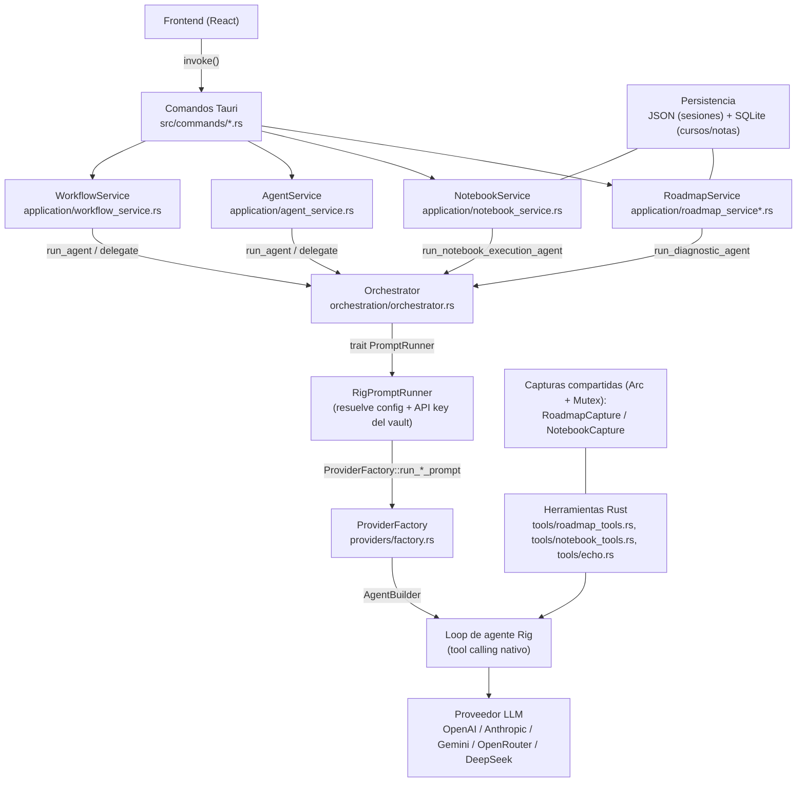
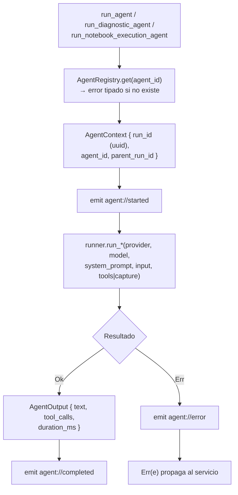
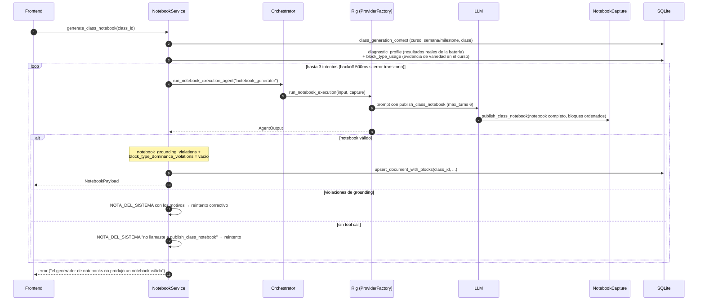

# Flujo de agentes y de generación con herramientas

Cómo LearnKit ejecuta agentes contra LLMs, cómo funciona el tool-calling, y cómo los dos
flujos de generación (roadmap y notebook) usan ese mecanismo. Referencias de código con
rutas reales bajo `src-tauri/src/`.

---

## 1. Capas y componentes



Responsabilidades por capa:

- **Comandos Tauri** (`src/commands/`): punto de entrada del frontend. Sin lógica.
- **Servicios de aplicación**: caso de uso completo (gates, reintentos, persistencia).
- **Orchestrator**: ejecuta UN agente por run (ids, `parent_run_id`, eventos). No sabe de
  gates ni de negocio.
- **ProviderFactory**: el ÚNICO lugar donde se construyen clientes Rig. Resuelve modelo,
  presupuestos de tokens y timeouts.
- **Herramientas**: structs Rust que implementan `rig_agent::tool::Tool`. Se registran en
  el builder de Rig y escriben en una captura compartida cuando el LLM las llama.

---

## 2. Flujo de agente (Orchestrator)

Tres variantes de ejecución, cada una con su método propio y tipado (sin abstracción
compartida de "cualquier set de herramientas"):

| Método del Orchestrator | Usado por | Runner | Herramientas |
|---|---|---|---|
| `run_agent` | `AgentService`, `WorkflowService`, `delegate` | `run` | lista id-gated (`AgentDefinition.tools`, solo `echo` existe) |
| `run_diagnostic_agent` | `RoadmapService` (cada turno del diagnóstico) | `run_diagnostic_execution` | set fijo de 4 herramientas → `RoadmapCapture` |
| `run_notebook_execution_agent` | `NotebookService::generate_class_notebook` | `run_notebook_execution` | 1 herramienta (`publish_class_notebook`) → `NotebookCapture` |



Detalles:

- El `AgentDefinition` fija el modelo (`provider_id`, `model`) — gana sobre el default del
  proveedor (orchestrator.rs:89-90).
- Logging solo de metadatos: nunca prompts, keys ni respuestas completas.
- `delegate(from, to, task)` valida ambos agentes y ejecuta `to` con `parent_run_id`
  nuevo (orchestrator.rs:353-370). Es el patrón MVP; fan-out/supervisor queda para después.
- Los eventos Tauri (`agent://started|completed|error`) nunca fallan un run
  (orchestrator.rs:373-383). Las herramientas emiten además `agent://tool` vía
  `emit_tool_event` (tools/mod.rs:25-29), desde un `AppHandle` global registrado en el
  setup de `lib.rs` — porque corren dentro del loop de Rig donde no hay handle en scope.

---

## 3. Tool-calling: cómo llegan los args estructurados

`ProviderFactory` construye un agente Rig con las herramientas registradas y corre UN
turno de prompt. Rig maneja el loop nativo de tool-calling: cuando el LLM decide llamar
una herramienta, Rig la ejecuta en Rust (el `call()` del struct) con args ya deserializados
al tipo `Args` de la herramienta, y el resultado vuelve al LLM para que decida el
siguiente paso. Las herramientas NO hacen lógica de negocio: solo escriben en la captura
(`Arc<Mutex<...>>`) y devuelven un ack. Quien lee la captura al terminar el turno es el
servicio de aplicación.

| Herramienta | Compuerta / uso | Args (`type`) | Escribe en | Salida |
|---|---|---|---|---|
| `submit_diagnostic_assessment` | Gate 1 — captura | `DiagnosticAssessmentArgs` | `capture.assessment` | `SavedAck` |
| `present_diagnostic_battery` | Gate 2 — batería | `DiagnosticBattery` | `capture.diagnostic_battery` | `SavedAck` |
| `propose_syllabus_plan` | Gate 3 — propuesta | `ProposeSyllabusPlanArgs` | `capture.propose_syllabus_plan` | `SavedAck` |
| `confirm_syllabus_plan` | Gate 4 — confirmación | `ConfirmSyllabusPlanArgs` (incluye `firstClassNotebook`) | `capture.confirm_syllabus_plan` | `SavedAck` |
| `publish_class_notebook` | generación de notebook | `GeneratedDynamicNotebook` | `NotebookCapture` | `PublishedAck { saved, block_count }` |
| `echo` | demo/testing | string | — | el mismo texto |

Presupuestos y límites (factory.rs, roadmap_service.rs):

- `PROMPT_TIMEOUT_SECS = 120` por llamada al LLM; HTTP liviano 30s.
- `PLAIN_MAX_TOKENS = 8192` para turnos chicos; `output_budget` da 16384 para turnos de
  ejecución (DeepSeek se capa a 8192 en su API).
- `DIAGNOSTIC_MAX_TURNS = 6` y `NOTEBOOK_MAX_TURNS = 6`: Rig aborta con `MaxTurnsError`
  antes; un turno del roadmap puede encadenar hasta 2 tool calls secuenciales, cada uno
  consume al menos un turno del budget.
- Errores transitorios (`is_transient`) se reintentan con backoff; los permanentes no.

---

## 4. Flujo de generación del roadmap (4 compuertas)

`RoadmapService` (`application/roadmap_service.rs` + `flow.rs`) implementa un Strict
Gated Flow con UN agente (`roadmap_syllabus_diagnostic`, roadmap_agent.rs) y 4
herramientas. El turn cap es load-bearing: se enforcea en Rust, no solo en el prompt.

```mermaid
sequenceDiagram
    autonumber
    participant UI as Frontend
    participant RS as RoadmapService
    participant ORCH as Orchestrator
    participant RIG as Rig (ProviderFactory)
    participant LLM as LLM
    participant CAP as RoadmapCapture
    participant ST as Persistencia

    UI->>RS: start_roadmap_session()
    Note over RS,ST: Bienvenida local (hash del session_id), SIN modelo ni turno gastado
    RS-->>UI: bienvenida

    UI->>RS: send_roadmap_message(meta, nivel, ...)
    Note over RS: Techos previos: turn_count_in_phase >= 2 → force_close;<br/>consecutive_grounding_failures >= 2 → force_progress
    RS->>ORCH: run_diagnostic_agent("roadmap_syllabus_diagnostic")
    ORCH->>RIG: run_diagnostic_execution(input, capture)
    RIG->>LLM: prompt con las 4 herramientas<br/>(max_turns 6, timeout 120s, budget 16384)
    LLM->>CAP: submit_diagnostic_assessment (Compuerta 1)
    LLM->>CAP: present_diagnostic_battery (Compuerta 2, MISMO turno)
    Note over CAP: Se omite la batería si entryLevel = absolute_zero;<br/>entonces propose_syllabus_plan encadena aquí
    RIG-->>RS: texto + capture
    RS->>RS: apply_capture(): validar grounding<br/>(rechazo → reintento EN el mismo turno, máx 2,<br/>reinyectando last_rejection_reasons)
    RS->>ST: save sesión (turno user persistido ANTES del modelo)
    RS-->>UI: texto breve + batería renderizada

    loop 3-4 respuestas (calificación determinista, sin modelo)
        UI->>RS: answer_diagnostic_question(i, respuesta)
    end
    Note over RS: Última respuesta → finish_diagnostic_stage() = Gate 3a

    RS->>ORCH: run_diagnostic_agent (input con diagnosticResults)
    ORCH->>RIG: run_diagnostic_execution
    RIG->>LLM: prompt
    LLM->>CAP: propose_syllabus_plan (Compuerta 3)
    RS->>RS: apply_capture(): pace_hours_per_week = weeklyCommitmentHours<br/>+ syllabus_violations (anti-monolito, módulos ≤ 5h)
    RS-->>UI: closingQuestion + temario propuesto (NO persiste)

    alt el estudiante confirma
        UI->>RS: send_roadmap_message("sí, está bien")
        RS->>ORCH: run_diagnostic_agent
        RIG->>LLM: prompt
        LLM->>CAP: confirm_syllabus_plan (Compuerta 4, firstClassNotebook)
        RS->>RS: seal_session(): importar curso→hitos→clases,<br/>notebook de la 1ª clase, batería+respuestas al curso
        RS-->>UI: "Plan de N semanas guardado..." + sesión sellada (fase roadmap)
    else el estudiante pide cambios
        UI->>RS: send_roadmap_message(ajustes)
        Note over RS,LLM: propose_syllabus_plan otra vez (Gate 3)<br/>— negociación sin cap, la maneja el estudiante
    end
```

### Estados y compuertas en `apply_capture` (flow.rs:103-259)

| Compuerta | Precondición (si falta → rechazo con motivo) | Efecto al validar |
|---|---|---|
| 1 `assessment` | — | `learner_profile_card`; fase `onboarding → diagnostic` |
| 2 `battery` | perfil existe; NO re-presentar una ya respondida (es violación real) | `pending_diagnostic_battery` — la sesión ESPERA |
| 3 `propose` | perfil + batería respondida (o `absolute_zero`) | `diagnostic_summary_card` + `proposed_plan` (propuesta) |
| 4 `confirm` | propuesta existe | `seal_session()` → curso persistido, sesión `sealed` |

Cadena esperada: Gates 1+2 en el MISMO turno (o 1+3 si `absolute_zero`); Gates 3 y 4
cada uno su turno, separados por respuestas reales del estudiante.

### Redes de seguridad (backstops)

1. **`force_close_session`** (flow.rs:427-445): cuando `turn_count_in_phase` llega a
   `MAX_GATHER_TURNS = 2` sin estado estable, sintetiza defaults honestos (perfil,
   diagnóstico, temario, batería sin responder, notebook) y sella sin llamar al modelo.
2. **`force_progress_from_gate3`** (flow.rs:458-474): cuando
   `consecutive_grounding_failures` llega a `MAX_CONSECUTIVE_GROUNDING_FAILURES = 2`
   DESPUÉS de que la batería fue respondida (el modelo no aterriza un propose/confirm
   válido en varios turnos reales seguidos), sella reutilizando el progreso real (la
   batería contestada y una propuesta previa si existe).
3. **Reintento de grounding en el mismo turno** (`run_diagnostic_turn_with_grounding_retry`,
   flow.rs:290-321): hasta `MAX_GROUNDING_RETRIES = 2`, reinyectando los motivos de
   rechazo. Si sigue fallando, texto honesto: "Casi lo tengo — dame un momento más…".
4. **Reintento transitorio** (`run_diagnostic_turn_with_retry`, flow.rs:50-73): hasta
   `MAX_EXECUTION_ATTEMPTS = 3` con backoff 500ms × intento (fallas de red observadas en
   DeepSeek).
5. **`skip_diagnostic_battery`** (roadmap_service.rs:391-400): escape hatch para no dejar
   al estudiante atascado en la batería.
6. **`retry_pending_turn`** (roadmap_service.rs:347-384): reintento manual de la UI que
   retoma donde quedó el error (log termina en `user`, o batería completa sin propuesta)
   sin duplicar el turno del usuario.
7. **`ensure_course_imported`** (flow.rs:403-419): recuperación idempotente si un session
   sellado no tiene curso importado en SQLite.

---

## 5. Flujo de generación de notebook

`NotebookService::generate_class_notebook` (notebook_service.rs:70-150) convierte UNA
clase (una por micromódulo) en un notebook de 3-5 bloques vía UNA sola llamada a
`publish_class_notebook`. A diferencia del roadmap, aquí no hay estado que proteger:
generación idempotente y reintentable, sin backstop de pedagogía sintetizada (fabricar
"teoría" sería engañoso) — la falla persistente se surfacea como error y la UI ofrece
reintentar.



### Validaciones del notebook

- **`notebook_grounding_violations`** (notebook_service.rs): validez interna de UN
  notebook — secciones suficientes, contenido requerido por bloque.
- **`block_type_dominance_violations`** (notebook_service.rs:174+): validez contra los
  OTROS clases del mismo curso — si un blockType aparece en más de la mitad de las clases
  generadas, se rechaza el nuevo que lo repita (corrige el hábito real del modelo de
  repetir siempre el mismo bloque de práctica).
- El `diagnosticProfile.weakPoints` personaliza la clase: `intuition` → más analogías y
  menos terminología; `mechanics` → más walkthrough visual; `critical_case` → prioriza
  `heuristic_error_audit` sobre ese error concreto (notebook_agent.rs, sección USO DE
  diagnosticProfile).

### Agentes del sistema

| Agente | id | Modelo default | Rol |
|---|---|---|---|
| Roadmap & Syllabus Diagnostic | `roadmap_syllabus_diagnostic` | anthropic / claude-sonnet-4-6 | 4 compuertas: convierte la meta en plan + primera clase |
| Notebook Generator | `notebook_generator` | anthropic / claude-sonnet-4-6 | una clase → notebook de 3-5 bloques, composición dinámica |
| Researcher (demo) | `researcher` | openai / gpt-5 | análisis estructurado, herramienta `echo` |
| Writer (demo) | `writer` | anthropic / claude-sonnet-4-6 | reescribe findings en respuesta final (demo `research → draft`) |

---

## 6. Eventos hacia el frontend

| Canal | Emisor | Cuándo |
|---|---|---|
| `agent://started` | Orchestrator | al iniciar un run |
| `agent://completed` | Orchestrator | run terminado OK (incluye texto) |
| `agent://error` | Orchestrator | run fallido |
| `agent://tool` | Herramientas (`emit_tool_event`) | cada vez que el LLM llama una herramienta, dentro del loop de Rig |
